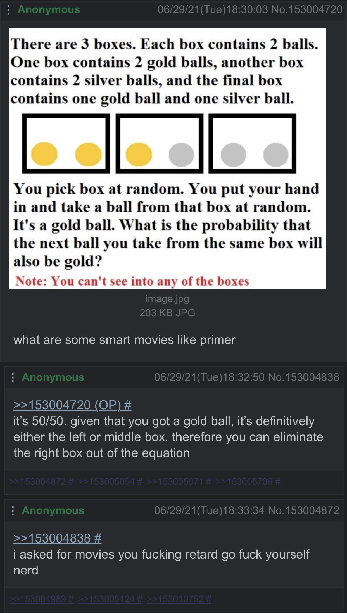
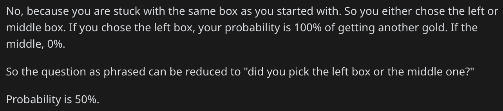
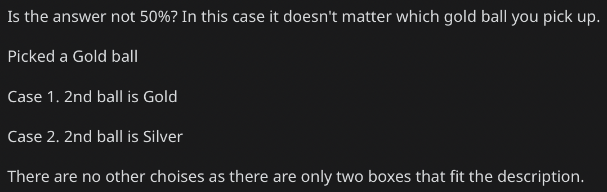

A couple of months ago I came across this [Reddit post](https://www.reddit.com/r/4chan/comments/oanchy/typical_tv/) where people are arguing about a Monty-Hall-esque probability brain teaser. 

The problem is given by this 4chan screenshot:

While many people recognized this as [Betrand's box paradox](https://en.wikipedia.org/wiki/Bertrand%27s_box_paradox) and provided the answer $$2/3$$ to the problem, many remain unconvinced and agree with the first commenter in the screenshot:

* * *

Let $$X \in \{gg, gs, ss\}$$ be the box chosen, $$B_1, B_2 \in \{g, s\}$$ be the types of the first and second ball drawn. 

The quantity of interest is $$P(B_2 = g | B_1 = g) = P(X = gg | B_1 = g)$$. The equality holds because given that we cannot switch boxes, another gold ball can only be drawn if and only if we picked the box with two gold balls in the first place. 

* * *

Now that the notations have been defined, the pitfall of the argument for $$1/2$$ can be explained easily with the (conditional) law of total probability:

$$
\begin{align}
&P(X = gg | B_1 = g) \\
=& P(X = gg | B_1 = g, X = gg) P(X = gg | B_1 = g) \\
&\quad + P(X = gg | B_1 = g, X = gs) P(X = gs | B_1 = g) \\
&\quad + P(X = gg | B_1 = g, X = ss) P(X = ss | B_1 = g) \\
=& 1 \cdot P(X = gg | B_1 = g) + 0 \cdot P(X = gs | B_1 = g) + 0 \cdot P(X = ss | B_1 = g) \\
=& P(X = gg | B_1 = g). 
\end{align}
$$

Notice we cannot proceed because this expansion uses the very value we want to compute.  

The mistake many people make is believing that $$P(X = gg | B_1 = g) = P(X = gs | B_1 = g) = 1/2$$. 
Intuitively this kind of makes sense -- clearly we couldn't have picked the box with two silver balls when the first ball is gold, so it comes down to randomly selecting one out of the two remaining boxes. 

The problem is, $$P(X = gg) = P(X = gs)$$ does not imply $$P(X = gg | B_1 = g) = P(X = gs | B_1 = g)$$. 
This is evidenced by the observation that $$P(X = ss) = P(X = gg) = P(X = gs) = 1/3$$, but $$P(X = ss | B_1 = g) = 0$$. 

As it turns out, the information that the first ball is gold tells us it's more likely that we picked the box with two gold balls (and that probability is exactly $$2/3$$). 

* * *

Now, we show why $$P(X = gg | B_1 = g) = 2/3$$. 

Using the definition of conditional probabilities $$P(A | B) = P(A \cap B) / P(B)$$, we can see that
$$
\begin{align}
P(B | A)
= \frac{P(A | B) P(B)}{P(A)}. 
\end{align}
$$

Applying this to our problem with $$A = {B_1 = g}$$ and $$B = {X = gg}$$, 
$$
\begin{align}
&P(X = gg | B_1 = g)
=& \frac{P(B_1 = g | X = gg) P(X = gg)}{P(B_1 = g)} \\
=& \frac{1 \cdot 1/3}{1/3 \cdot 3/2} \\
=& \frac{2}{3},
\end{align}
$$
where the last equality follows again from the law of total probability:
$$
\begin{align}
&P(B_1 = g)
=& P(B_1 = g | X = gg) P(X = gg) + P(B_1 = g | X = gs) P(X = gs) + P(B_1 = g | X = ss) P(X = ss) \\
=& 1 \cdot \frac{1}{3} + \frac{1}{2} \cdot \frac{1}{3} + 0 \cdot \frac{1}{3} \\
=& \frac{1}{3} \cdot \frac{3}{2}. 
\end{align}
$$
